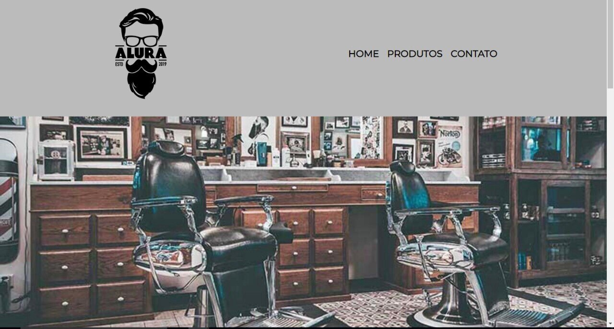

  <h1 align="center">Barba Bem Feita</h1>

  <h2 align="center">Sobre o projeto:</h2>
  
https://gabelucet.github.io/Barba-bem-feita/index.html  
  Esse projeto é um site construído com os ensinamentos dos cursos de HTML e CSS da plataforma Alura, visando meu desenvolvimento e evolução com o CSS e HTML 
  A construção do site visa o atendimento em uma barbearia fictícia, onde é mostrado um pouco da história da barbearia, sua localização e seus horários de atendimento.      
  Também foi construído uma página apenas para os serviços que são prestados na barbearia, com isso, deixando o site completo e mostrando toda a experiência que o         cliente terá, ao visitar a nossa barbearia.

  <h3 align="center">Layout Mobile</h3>
  
Pensando na usabilidade dos clientes que usariam a barbearia, o site também é responsivo, ou seja, também se adapta a tela de dispositivos moveis.      
  Logo abaixo, você poderá ver como fica às três páginas do site através da tela do celular.

  

  
  

  <h3 align=center>Layout web</h3>
  
Essa é a versão para Web

  

   
   
  
  

  <h2 align="center"> Tecnologias utilizadas</h2>
  - HTML 
  - CSS

<h3 align="center"> Autor</h3>

 Trabalho feito por Gabriel Nascimento da Silve

  
  

